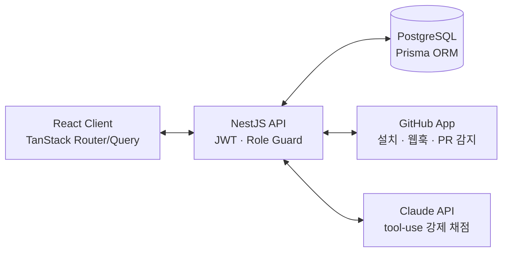

# Rubrix

> GitHub PR을 루브릭 기준으로 자동 채점하는 과제형 코딩 학습 플랫폼

학생은 과제를 받아 GitHub 레포를 연결하고 PR로 제출하면, AI가 루브릭 기준별로 점수와 라인 단위 리뷰 코멘트를 남깁니다. 멘토가 수십 개의 PR을 일일이 채점하는 병목을 AI로 옮기고, 사람은 애매한 케이스만 보게 하는 것이 목표입니다.

### MVP 개발 기간

2026.07.20 ~ 2026.07.29

### 역할

API 설계 · DB 마이그레이션 · 인증 · GitHub App 연동 · AI 채점 파이프라인 · UI 전 구간 직접 구현

## 핵심 기능

- **관리자 대시보드** : 과제/루브릭 CRUD, 게시 유/무 토글, 역할 기반 접근 제어
- **GitHub App 연동** : OAuth 로그인, 레포 연결, 웹훅 기반 PR 자동 감지
- **AI 채점 파이프라인** : PR diff를 Claude에 전달, 루브릭 항목별 점수, 요약, 라인 코멘트를 `tool_choice`로 구조화 강제하였고, 실제로 심어둔 버그(정렬 오류)를 정확한 예시와 함께 잡아내는 것까지 검증
- **리포트, 마이페이지, 티어** : 채점 결과 안내 UI, 제출 이력, 티어제 도입

## 아키텍처



## 기술 스택

| 영역     | 스택                                                                  |
| -------- | --------------------------------------------------------------------- |
| Backend  | NestJS 11, Prisma 7, PostgreSQL, JWT, class-validator                 |
| Frontend | React 19, TanStack Router/Query, React Hook Form, Zod, Tailwind CSS 4 |
| AI       | Anthropic Claude API (tool-use)                                       |
| Infra    | Docker Compose, GitHub Actions, GitHub App API                        |

## 실행 방법

```bash
git clone <repo-url>
cd rubrix

# server/.env, client/.env 각각 작성 (아래 환경변수 목록 참고)

docker compose up --build
# client  http://localhost:5173
# server  http://localhost:3000
```

### 환경변수

`server/.env`

| 변수                                                                  | 설명                                  |
| --------------------------------------------------------------------- | ------------------------------------- |
| `DATABASE_URL`                                                        | PostgreSQL 연결 문자열                |
| `GITHUB_CLIENT_ID` / `GITHUB_CLIENT_SECRET`                           | GitHub OAuth 앱 (로그인용)            |
| `JWT_SECRET`                                                          | 액세스 토큰 서명 키                   |
| `CLIENT_URL`                                                          | 프론트엔드 오리진 (콜백 리다이렉트용) |
| `GITHUB_APP_ID` / `GITHUB_APP_CLIENT_ID` / `GITHUB_APP_CLIENT_SECRET` | GitHub App 자격 증명                  |
| `GITHUB_APP_PRIVATE_KEY`                                              | GitHub App RS256 서명 키              |
| `GITHUB_APP_WEBHOOK_SECRET`                                           | 웹훅 HMAC-SHA256 서명 검증용          |
| `ANTHROPIC_API_KEY`                                                   | Claude API 키                         |

`client/.env`

| 변수                    | 설명                         |
| ----------------------- | ---------------------------- |
| `VITE_API_URL`          | 백엔드 API 오리진            |
| `VITE_GITHUB_CLIENT_ID` | GitHub OAuth 앱 client ID    |
| `VITE_GITHUB_APP_SLUG`  | GitHub App 설치 URL용 슬러그 |

## 폴더 구조

```
rubrix/
├─ server/        # NestJS API : 도메인별 모듈(auth, assignment, github-app, repo, pull-request, submission, grading)
├─ client/        # React: features/ 도메인 단위, atom/composition-components 공용 UI
└─ docker-compose.yml
```
